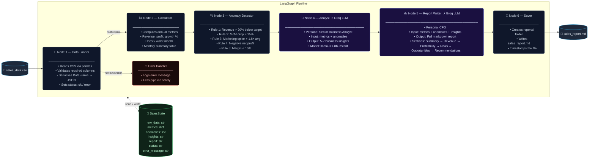

# Sales Agent — LangGraph Architecture

```mermaid
flowchart LR
    CSV[(📄 sales_data.csv)]:::data

    subgraph Nodes["LangGraph Pipeline"]
        N1["🔌 Node 1 — Data Loader
        ─────────────────────
        • Reads CSV via pandas
        • Validates required columns
        • Serialises DataFrame → JSON
        • Sets status: ok / error"]:::nodeBox

        N2["📊 Node 2 — Calculator
        ─────────────────────
        • Computes annual metrics
        • Revenue, profit, growth %
        • Best / worst month
        • Monthly summary table"]:::nodeBox

        N3["🔍 Node 3 — Anomaly Detector
        ─────────────────────────────
        • Rule 1: Revenue > 20% below target
        • Rule 2: MoM drop > 15%
        • Rule 3: Marketing spike > 1.8× avg
        • Rule 4: Negative net profit
        • Rule 5: Margin < 15%"]:::nodeBox

        N4["🤖 Node 4 — Analyst  ⚡ Groq LLM
        ────────────────────────────────────
        • Persona: Senior Business Analyst
        • Input: metrics + anomalies
        • Output: 5-7 business insights
        • Model: llama-3.1-8b-instant"]:::llmBox

        N5["✍️ Node 5 — Report Writer  ⚡ Groq LLM
        ──────────────────────────────────────────
        • Persona: CFO
        • Input: metrics + anomalies + insights
        • Output: Full markdown report
        • Sections: Summary → Revenue →
          Profitability → Risks →
          Opportunities → Recommendations"]:::llmBox

        N6["💾 Node 6 — Saver
        ──────────────────
        • Creates reports/ folder
        • Writes sales_report.md
        • Timestamps the file"]:::nodeBox

        ERR["⚠️ Error Handler
        ────────────────
        • Logs error message
        • Exits pipeline safely"]:::errorBox
    end

    STATE[("🎒 SalesState
    ──────────────
    raw_data: str
    metrics: dict
    anomalies: list
    insights: str
    report: str
    status: str
    error_message: str")]:::stateBox

    REPORT[(📝 sales_report.md)]:::data

    CSV --> N1 -->|status=ok| N2 --> N3 --> N4 --> N5 --> N6 --> REPORT
    N1 -->|status=error| ERR

    Nodes <-.->|read / write| STATE

    classDef data        fill:#1e293b,stroke:#38bdf8,color:#e2e8f0,rx:8
    classDef nodeBox     fill:#0f172a,stroke:#64748b,color:#cbd5e1,rx:6
    classDef llmBox      fill:#1a1040,stroke:#818cf8,color:#e0e7ff,rx:6
    classDef errorBox    fill:#1a0a0a,stroke:#f87171,color:#fecaca,rx:6
    classDef stateBox    fill:#0f2318,stroke:#4ade80,color:#bbf7d0,rx:8
```
