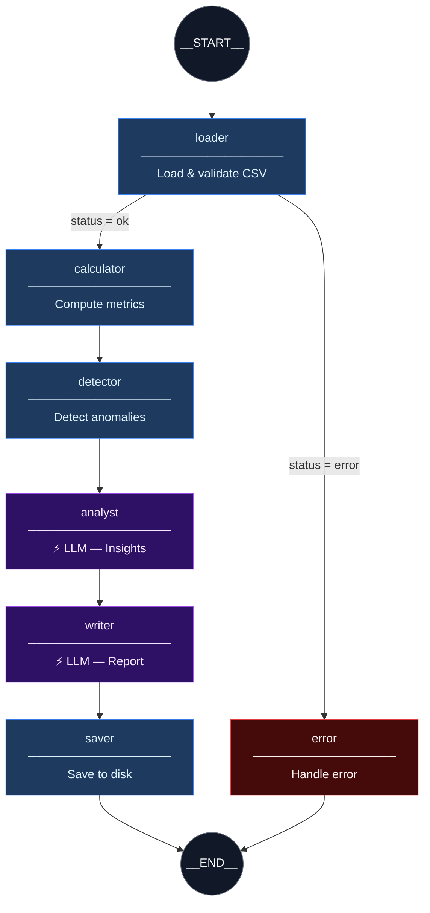

# Sales Agent — LangGraph Graph

```mermaid
flowchart TD
    START((__START__)):::terminal
    END((__END__)):::terminal

    loader["loader\n─────────────────\nLoad & validate CSV"]:::node
    calculator["calculator\n─────────────────\nCompute metrics"]:::node
    detector["detector\n─────────────────\nDetect anomalies"]:::node
    analyst["analyst\n─────────────────\n⚡ LLM — Insights"]:::llm
    writer["writer\n─────────────────\n⚡ LLM — Report"]:::llm
    saver["saver\n─────────────────\nSave to disk"]:::node
    error["error\n─────────────────\nHandle error"]:::err

    START --> loader
    loader -->|status = ok| calculator
    loader -->|status = error| error
    calculator --> detector
    detector --> analyst
    analyst --> writer
    writer --> saver
    saver --> END
    error --> END

    classDef terminal   fill:#111827,stroke:#6b7280,color:#f9fafb
    classDef node       fill:#1e3a5f,stroke:#3b82f6,color:#e0f2fe
    classDef llm        fill:#2e1065,stroke:#a855f7,color:#f3e8ff
    classDef err        fill:#450a0a,stroke:#ef4444,color:#fef2f2
```
